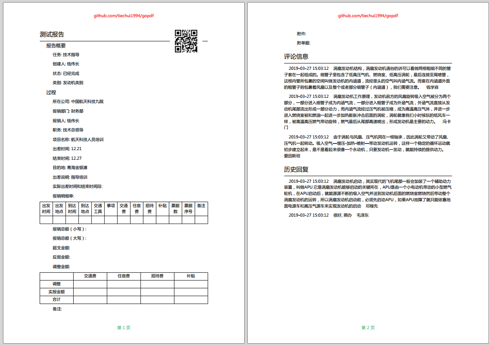
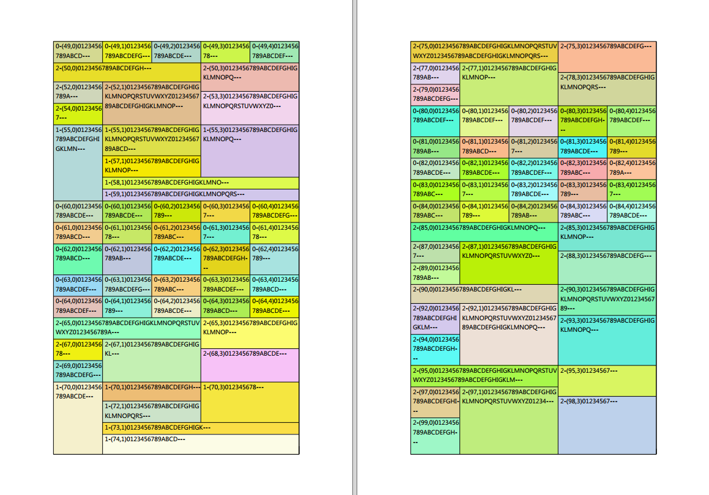

# gopdf

gopdf 是一个生成PDF文档的 Golang 库.

特点:

- 支持 Unicode 字符 (包括中文, 日语, 朝鲜语, 等等.)
- PDF 文档自动分页
- PDF 文档自动换行
- PDF 文档自动化全局定位, 不需要用户去手动定位
- PDF 默认的配置选项简单, 且已经内置了常用的几种方式
- PDF 文档采用类似 html 页面的属性设置, 通俗易懂
- PDF 支持图片插入, 格式可以是PNG或者JPEG, 图片会进行适当压缩
- PDF 支持文档压缩
- PDF 转换单位内置处理
- Executor 可以嵌套使用

安装:

```
go get -u github.com/tiechui1994/gopdf
```

案例: 

[代码](./example/complex_report_test.go#L26)




[代码](./table_test.go#L19)


[代码](./table_test.go#L164)


